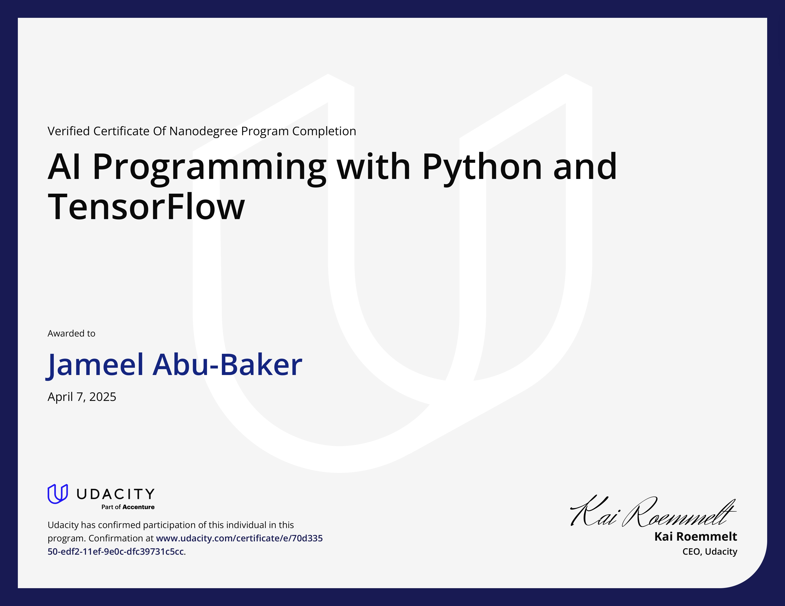
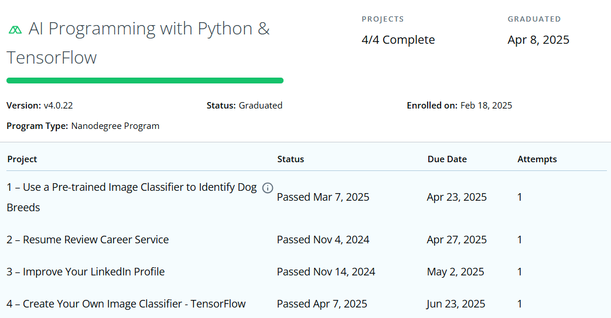

# AI Programming with Python & TensorFlow – Udacity Nanodegree

This repository contains the projects completed as part of the **AI Programming with Python & TensorFlow** Nanodegree program offered by **Udacity**.

I successfully completed this Nanodegree as a participant in the **4th cohort of the Palestine Launchpad with Google program**. The program covered essential AI skills including Python programming, NumPy, Pandas, Matplotlib, Linear Algebra, and TensorFlow, culminating in the implementation of custom and pre-trained image classifiers.

## 📜 Program Details

- **Provider:** Udacity
- **Nanodegree:** AI Programming with Python & TensorFlow
- **Cohort:** 4th Palestine Launchpad with Google
- **Start Date:** February 18, 2025
- **Graduation Date:** April 8, 2025
- **Projects Completed:** 4 / 4

## 📂 Included Projects

**1. Use a Pre-trained Image Classifier to Identify Dog Breeds**

**4. Create Your Own Image Classifier – TensorFlow**

## 🏆 Certification

## 📊 Project Dashboard

